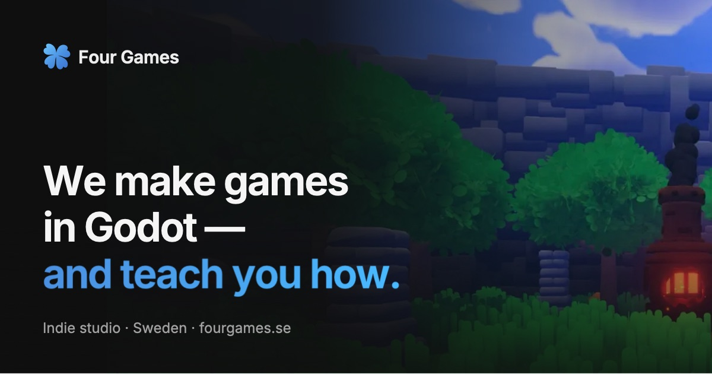

# fourgames.se

The website of **Four Games**, an indie studio making games in Godot, sharing free tutorials and open-sourcing the tools we use.

Vue 3 + Vite + Tailwind CSS v4, prerendered to static HTML and hosted on GitHub Pages. The look and layout follow [godotengine.org](https://godotengine.org): light/dark follows the OS setting, Montserrat for headings, system font for body text.

## Development

Requires Node 22.12+ (see `.nvmrc`).

```bash
npm install
npm run dev       # dev server on http://localhost:5173
npm run data      # fetch fresh Steam / YouTube / GitHub / Discord data
npm run build     # build + prerender every page into dist/
npm run preview   # serve dist/ like GitHub Pages does, on http://localhost:4173
```

`npm run dev` and `npm run build` work offline and without API keys; sections just show their empty states until you run `npm run data`.

## Editing content

Most content lives in small data files — no component changes needed:

| File | What it controls |
|---|---|
| `src/data/games.js` | Unannounced games and per-game overrides — published games are discovered from Steam automatically |
| `src/data/roadmap.js` | "Our contributions to Godot" timeline on /code |
| `src/data/partners.js` | Collaboration cards on /jobs |
| `src/data/membership.js` | Membership tier, pitch and perks (feature cards + the navy band on the home page) |
| `src/data/nav.js` | Header links (left/right groups) and the pink "Donate" pill |
| `src/data/footer.js` | The four footer columns |
| `src/data/involve.js` | "Get involved" columns on the home page |
| `src/data/site.js` | Links, socials, hero headline, YouTube channel, Discord server, GitHub org, Formspree form |
| `src/router/routes.js` | Page titles and meta descriptions |

## Build-time data

`scripts/fetch-data.mjs` fetches live data at build time and writes it to `src/data/generated/` (gitignored):

- **Steam** — app IDs are discovered from the public store search, filtered by `SITE.steam.publisher` / `.developer`, so a new store page appears on the site within a day without a code change (no API key or login needed). Each app then supplies name, art, description, genres, price and release date. Unannounced games can't be discovered publicly, so they stay listed in `src/data/games.js` and show a "Coming soon" card until their page goes live.
- **YouTube** — the all-time most popular video and the latest uploads (Shorts and livestreams excluded).
- **GitHub** — all public repositories in the `fourgames` org, sorted by stars.
- **Discord** — server name, online count and a few avatars (the card also refreshes live in the browser).

If a source fails, the previous data is kept (or the section shows its empty state) — a third-party outage never breaks a deploy.

### YouTube API key

Without a key the site uses YouTube's public RSS feed (latest 15 uploads, so "most popular" only covers those). For the real all-time most popular video:

1. In the [Google Cloud Console](https://console.cloud.google.com/), create a project and enable **YouTube Data API v3**.
2. Create an **API key** and restrict it to the YouTube Data API v3.
3. In this repo: **Settings → Secrets and variables → Actions → New repository secret**, named `YOUTUBE_API_KEY`.
4. Optional, for local builds: put `YOUTUBE_API_KEY=...` in `.env.local` (gitignored).

A daily build uses about 10 of the 10,000 free quota units. The key is only read by the build script and never reaches the browser.

## Deployment

`.github/workflows/static.yml` builds and deploys to GitHub Pages on every push to `main`, on demand, and once a day (to pick up new videos, stars and store pages). GitHub pauses scheduled workflows after 60 days without repository activity — any push turns it back on.

## Accessibility & performance

- Every page is prerendered to real HTML with its own title, description, canonical URL and social preview.
- No third-party requests until you scroll or click: YouTube loads on play, Discord and Steam images load lazily.
- Skip link, landmarks, focus moved to the new page's heading on navigation, visible focus rings, WCAG AA contrast, and all motion is disabled for people who prefer reduced motion.

## License

MIT — see [LICENSE.md](LICENSE.md). Montserrat is licensed under the SIL Open Font License (`public/fonts/LICENSE-Montserrat.txt`). The clover icon is "Clover" by [Lorc](https://game-icons.net/), CC BY 3.0. Interface and illustration icons follow [Lucide](https://lucide.dev/) (ISC); platform icons are from godotengine.org.
